# 📚 Learning App

تطبيق تعليمي (ويب + أندرويد) من كود Flutter واحد: فيديوهات، دروس، تتبّع تقدّم، تسجيل دخول، أدوار وصلاحيات (مدير / مدرّس / طالب)، وإدارة دورات، ورسائل خاصة بين الطالب والمدرّس.

- **الويب:** https://learning-app-fff77.web.app
- **الخلفية:** Firebase (Authentication + Firestore + Hosting)

---

## لقطات الشاشة

<table>
<tr>
<td align="center">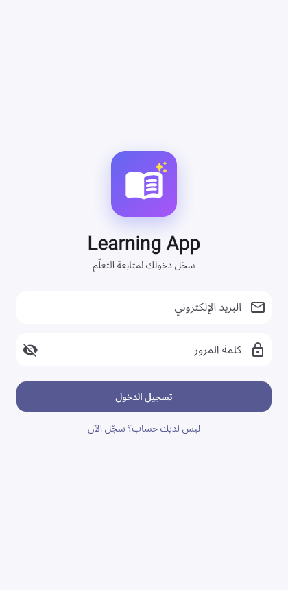<br><sub>تسجيل الدخول</sub></td>
<td align="center">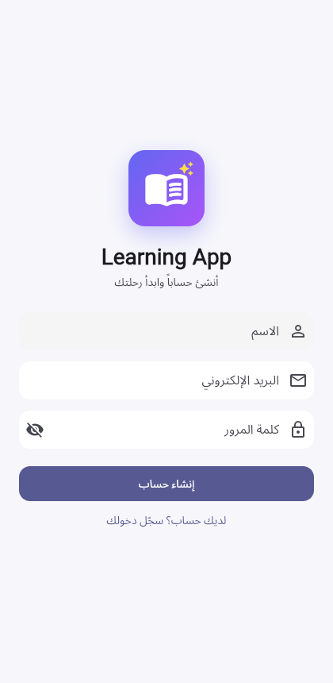<br><sub>إنشاء حساب</sub></td>
<td align="center">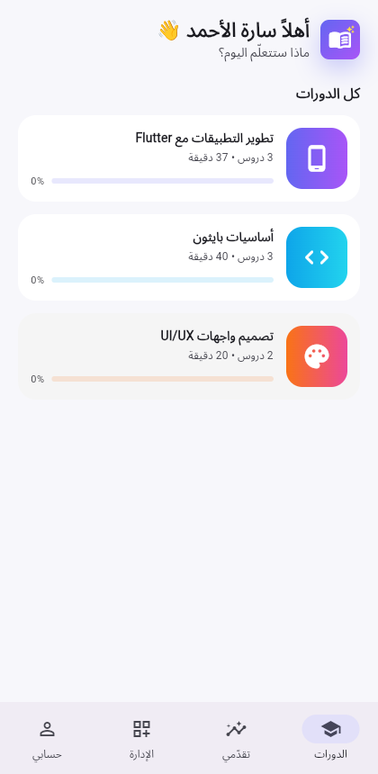<br><sub>الدورات + "تابع من حيث توقفت"</sub></td>
</tr>
<tr>
<td align="center">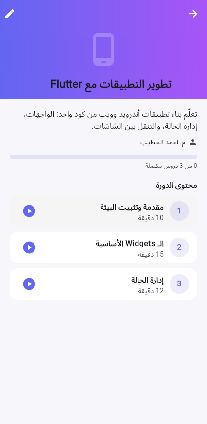<br><sub>تفاصيل الدورة</sub></td>
<td align="center">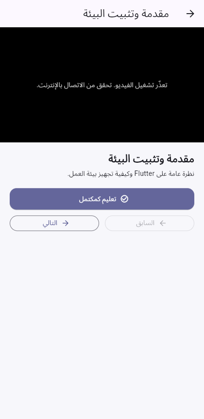<br><sub>مشغّل الفيديو</sub></td>
<td align="center">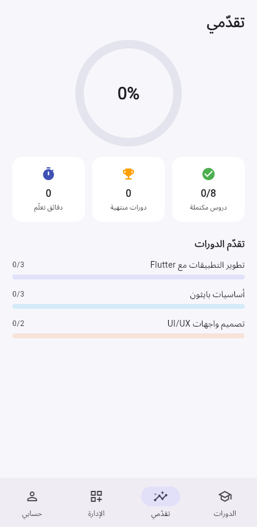<br><sub>تقدّمي</sub></td>
</tr>
<tr>
<td align="center">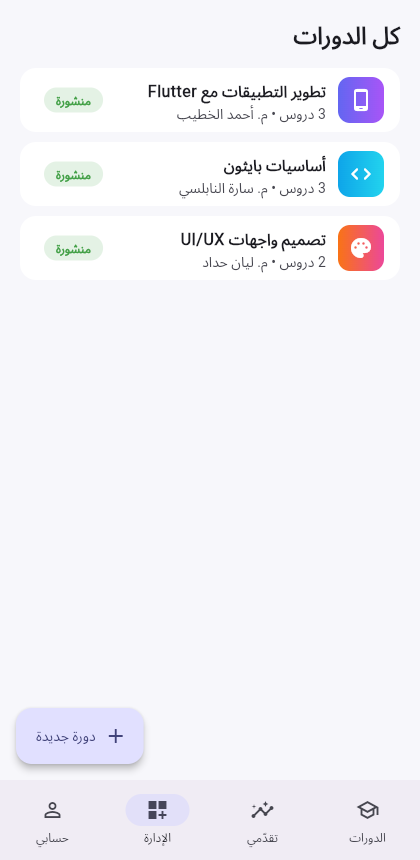<br><sub>إدارة الدورات (مدير/مدرّس)</sub></td>
<td align="center">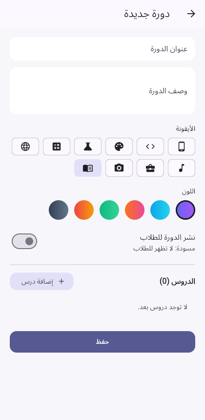<br><sub>محرّر الدورة</sub></td>
<td align="center">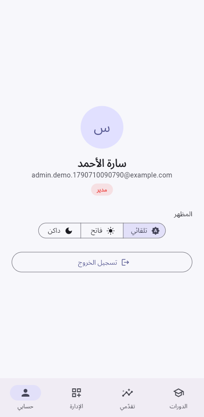<br><sub>الحساب — فاتح</sub></td>
</tr>
<tr>
<td align="center">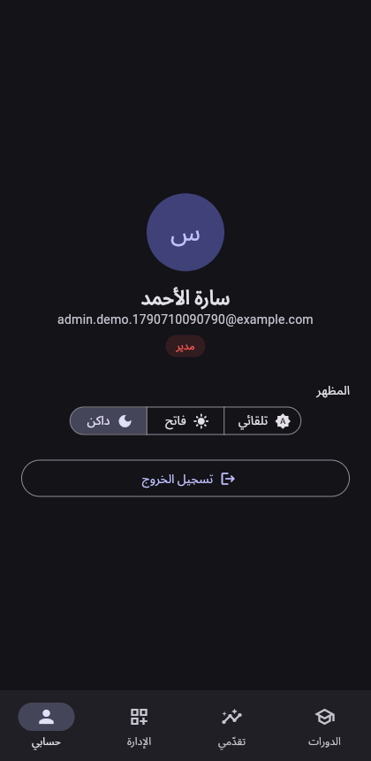<br><sub>الحساب — داكن</sub></td>
<td align="center">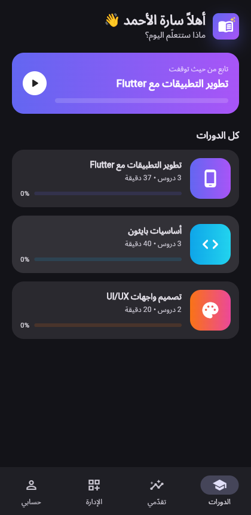<br><sub>الدورات — داكن</sub></td>
<td></td>
</tr>
</table>

> لقطات الشاشة مأخوذة بوضع محلي تجريبي (بدون Firebase) لأخذها بسرعة وأمان دون التأثير على الحسابات الحقيقية؛ شكل التطبيق مطابق تماماً للنسخة المتصلة بـ Firebase. شاشتا **إدارة المستخدمين** و**الرسائل الخاصة** تعملان فقط عند تفعيل Firebase (`kUseFirebase = true`)، وهو الوضع الفعلي المنشور على الرابط أعلاه.

---

## المزايا

- **تسجيل دخول وتسجيل حساب** عبر Firebase Authentication (بريد إلكتروني وكلمة مرور).
- **ثلاثة أدوار بصلاحيات حقيقية** مفروضة في قواعد أمان Firestore على السيرفر، وليس فقط بإخفاء أزرار في الواجهة:
  - **مدير:** يدير كل الدورات وأدوار كل المستخدمين.
  - **مدرّس:** ينشئ ويعدّل ويحذف دوراته الخاصة فقط.
  - **طالب:** يتعلّم ويتابع تقدّمه ويراسل.
  - أول حساب يسجّل في التطبيق يصبح **مديراً** تلقائياً (مرة واحدة فقط)؛ كل من بعده طالب حتى يرقّيه المدير.
- **إدارة الدورات:** عنوان، وصف، أيقونة ولون من مجموعة جاهزة، نشر أو حفظ كمسودة، وإضافة/تعديل/حذف/إعادة ترتيب الدروس بالسحب.
- **دروس فيديو:** تشغيل/إيقاف، شريط تقدّم، وتعليم الدرس كمكتمل تلقائياً عند مشاهدة 95% منه (أو يدوياً).
- **تتبّع التقدّم:** لكل مستخدم على حدة، نسبة إنجاز لكل دورة ونسبة عامة، ويُزامَن بين الويب والأندرويد عبر Firestore (تقدّم السحابة يفوز عند تسجيل الدخول، ويُرفع التقدّم المحلي الموجود مسبقاً تلقائياً).
- **رسائل خاصة:** الطالب يراسل المدرّسين والمدير (وزر "راسل المدرّس" داخل كل دورة)، والمدرّس والمدير يراسلان أي شخص، مع عدّاد رسائل غير مقروءة.
- **وضع داكن/فاتح/تلقائي**، يُحفظ الاختيار على الجهاز.
- **واجهة عربية RTL** بالكامل، وأيقونة تطبيق مصمَّمة خصيصاً (كتاب مفتوح + زر تشغيل).

---

## البنية التقنية

| الطبقة | التقنية |
|---|---|
| الواجهة | Flutter (Material 3) |
| الحالة | `ChangeNotifier` + `InheritedWidget` بسيط (`AppScope`) — بدون حزمة إدارة حالة خارجية |
| المصادقة | Firebase Authentication |
| قاعدة البيانات | Cloud Firestore (`profiles`, `courses`, `users` للتقدّم, `chats`) |
| الاستضافة | Firebase Hosting (ويب) |
| التخزين المحلي | `shared_preferences` (الثيم، وكل بيانات وضع "بدون Firebase") |
| الفيديو | حزمة `video_player` (روابط `mp4` مباشرة) |

### هيكلية `lib/`

```
lib/
├── config.dart               # مفتاح تفعيل Firebase (kUseFirebase)
├── firebase_options.dart     # مولَّد بواسطة flutterfire configure
├── models/                   # Course, Lesson, Profile/UserRole, Chat
├── data/courses_data.dart    # دورات تجريبية (sampleCourses) للاستيراد
├── services/
│   ├── auth_service.dart           # عقد المصادقة + الصلاحيات (canEditCourse...)
│   ├── local_auth_service.dart     # تنفيذ محلي (بدون Firebase)
│   ├── firebase_auth_service.dart  # تنفيذ Firebase + أول مستخدم = مدير
│   ├── course_repository.dart      # In-memory أو Firestore
│   ├── progress_service.dart       # تقدّم المستخدم + مزامنة سحابية
│   ├── directory_service.dart      # قائمة المستخدمين وتغيير الأدوار (Firebase فقط)
│   ├── chat_service.dart           # المحادثات الخاصة (Firebase فقط)
│   └── theme_controller.dart
├── screens/                  # كل شاشة UI
└── widgets/                  # عناصر مشتركة (شعار، شريط تقدّم، Pill/RoleChip)
```

---

## البدء السريع

### المتطلبات
- Flutter SDK (تم التطوير على 3.44.x / Dart 3.12).
- للأندرويد: Android SDK.
- (اختياري) مشروع Firebase خاص بك لتفعيل الحسابات السحابية.

### التشغيل

```bash
flutter pub get
flutter run -d chrome      # ويب
flutter run                # أندرويد (جهاز/محاكي متصل)
```

### وضعا التشغيل

يتحكم [lib/config.dart](lib/config.dart) بمصدر البيانات:

```dart
const kUseFirebase = false; // أو true
```

| الوضع | الحسابات | الأدوار | الدورات | الرسائل |
|---|---|---|---|---|
| `false` (محلي) | على الجهاز فقط (`shared_preferences`) | الجميع "طالب" دائماً | 3 دورات تجريبية مدمجة في الذاكرة | غير متاحة |
| `true` (Firebase) | Firebase Authentication، تُزامَن بين الأجهزة | فعلية (مدير/مدرّس/طالب)، أول مستخدم = مدير | Firestore، يديرها المدير/المدرّس من التطبيق | متاحة |

النسخة المنشورة تستخدم `true` مع مشروع Firebase حقيقي (`learning-app-fff77`).

---

## ربط مشروع Firebase الخاص بك (من الصفر)

```bash
dart pub global activate flutterfire_cli
flutterfire configure          # يولّد lib/firebase_options.dart لمشروعك
```

ثم في [Firebase Console](https://console.firebase.google.com):
1. فعّل **Authentication → Sign-in method → Email/Password**.
2. أنشئ قاعدة **Firestore Database** (Production mode).
3. انشر قواعد الأمان الجاهزة في المستودع:
   ```bash
   firebase deploy --only firestore:rules --project <project-id>
   ```
4. اجعل `kUseFirebase = true` في `lib/config.dart`.
5. أول من يسجّل حساباً في التطبيق بعدها يصبح المدير تلقائياً.

---

## الأدوار والصلاحيات

| الإجراء | طالب | مدرّس | مدير |
|---|:---:|:---:|:---:|
| مشاهدة الدورات المنشورة وتتبّع التقدّم | ✅ | ✅ | ✅ |
| مراسلة المدرّسين/المدير | ✅ | ✅ (أي شخص) | ✅ (أي شخص) |
| إنشاء/تعديل/حذف دوراته هو | ❌ | ✅ | ✅ |
| إدارة دورات الآخرين | ❌ | ❌ | ✅ |
| تغيير أدوار المستخدمين | ❌ | ❌ | ✅ |

الصلاحيات مفروضة في **طبقتين**: الواجهة تُخفي ما لا يخص المستخدم، وقواعد أمان Firestore ([firestore.rules](firestore.rules)) ترفض أي طلب مخالف حتى لو تم تجاوز الواجهة — وهذا ما يُختبر فعلياً (انظر قسم الاختبارات).

---

## الاختبارات

```bash
flutter analyze
flutter test
```

24 اختباراً في [test/widget_test.dart](test/widget_test.dart) تغطي: المصادقة، التقدّم ومزامنته، الأدوار والصلاحيات، النماذج، والشاشات (تسجيل، تسجيل دخول، الدورات، الوضع الداكن، إنشاء دورة كمدرّس...).

### اختبار قواعد أمان Firestore (على محاكي Firebase)

[rules_test/rules.test.js](rules_test/rules.test.js) يتحقق من القواعد نفسها: طالب لا يستطيع كتابة دورة، مدرّس لا يعدّل دورة غيره، لا يمكن لأحد انتحال دور مدير، لا يمكن قراءة محادثة لست طرفاً فيها... إلخ.

```bash
cd rules_test
npm install
cd ..
firebase emulators:exec --only firestore --project rules-test "cd rules_test && npm test"
```

---

## النشر

### الويب (Firebase Hosting)

```bash
flutter build web --release
firebase deploy --only hosting --project <project-id>
```

### أندرويد

```bash
flutter build apk --release           # ملف APK للتجربة المباشرة
flutter build appbundle --release     # .aab لرفعه على Google Play
```

> قبل النشر على Google Play: غيّر اسم الحزمة من `com.example.learning_app` إلى اسم خاص بك في `android/app/build.gradle.kts` و`AndroidManifest.xml`، ثم أعد `flutterfire configure`، ووقّع الحزمة بمفتاح إصدار خاص بك (الـ APK الحالي موقّع بمفتاح التطوير الافتراضي فقط).

---

## ملاحظات وقيود معروفة

- **خصوصية الملفات الشخصية:** اسم كل مستخدم وبريده ودوره مقروء لأي حساب مسجّل دخول (ضروري لبناء قائمة المراسلة)، وليس عاماً لغير المسجّلين. مناسب لتطبيق تعليمي صغير/مغلق؛ يحتاج تعديلاً إن أصبح عاماً بأعداد كبيرة.
- **روابط الفيديو:** يجب أن تكون روابط `mp4` مباشرة قابلة للوصول من المتصفح/الجهاز (لا يوجد رفع ملفات داخل التطبيق حالياً).
- **الوضع المحلي (`kUseFirebase = false`)** كل الحسابات فيه "طالب" ولا يدعم الأدوار أو الرسائل أو مزامنة السحابة — مخصّص للتجربة السريعة دون إعداد Firebase.

---

## الرخصة

مشروع خاص — لا يوجد ترخيص عام حالياً.
